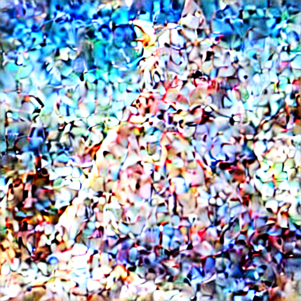

# stable-diffusion-webui-prompt-travel

    Travel between prompts in the latent space to make pseudo-animation, extension script for AUTOMATIC1111/stable-diffusion-webui.

----

<p align="left">
  <a href="https://github.com/Kahsolt/stable-diffusion-webui-prompt-travel/commits"></a>
  <a href="https://github.com/Kahsolt/stable-diffusion-webui-prompt-travel/issues"></a>
  <a href="https://github.com/Kahsolt/stable-diffusion-webui-prompt-travel/stargazers"></a>
  <a href="https://github.com/Kahsolt/stable-diffusion-webui-prompt-travel/network"></a>
  
  
  <br/>
</p>


Try interpolating on the hidden vectors of conditioning prompt to make seemingly-continuous image sequence, or let's say a pseudo-animation. 😀  

⚠ 我们成立了插件反馈 QQ 群: 616795645 (赤狐屿)，欢迎出建议、意见、报告bug等 (w  
⚠ We have a QQ chat group (616795645) now, any suggestions, discussions and bug reports are highly wellllcome!!  

ℹ 实话不说，我想有可能通过这个来做ppt童话绘本<del>甚至本子</del>……  
ℹ 聪明的用法：先手工盲搜两张好看的图 (只有prompt差异)，然后再尝试在其间 travel :lolipop:  


### Change Log

⚪ Compatibility Warning

- 2023/01/12: webui's recent commit [#50e25362794d46cd9a55c70e953a8b4126fd42f7](https://github.com/AUTOMATIC1111/stable-diffusion-webui/commit/50e25362794d46cd9a55c70e953a8b4126fd42f7) refactors CLIP-related code and make wrapper even more deeper, harder to hack in, causing the replace mode also henceforth dead. I finally decide to **remove the experimental 'replace' & 'grad'** functionality :( 
- 2023/01/04: webui's recent commit [#bd68e35de3b7cf7547ed97d8bdf60147402133cc](https://github.com/AUTOMATIC1111/stable-diffusion-webui/commit/bd68e35de3b7cf7547ed97d8bdf60147402133cc) saves memory use in forward calculation, but totally ruins backward gradient calculation via `torch.autograd.grad()` which this script heavily relies on. This change is so far not pluggable but forcely applied, so we're regrettable to say, prompt-travel's grad mode and part of the replace mode will be broken henceforth. (issue #7 cannot be fixed)

⚪ Features

- 2023/01/27: `v2.2` add 'slerp' linear interpolation method
- 2023/01/22: `v2.1` add experimental 'replace' mode again, it's not smooth interpolation
- 2023/01/20: `v2.0` add optional external [post-processing pipeline](#post-processing-pipeline) to highly boost up smoothness, greate thx to [Real-ESRGAN](https://github.com/xinntao/Real-ESRGAN) and [RIFE](https://github.com/nihui/rife-ncnn-vulkan)!!
- 2023/01/16: `v1.5` add upscale options (issue #12); add 'embryo' genesis, reproducing idea of [stable-diffusion-animation](https://replicate.com/andreasjansson/stable-diffusion-animation) except [FILM](https://github.com/google-research/frame-interpolation) support (issue #11)
- 2023/01/12: `v1.4` remove 'replace' & 'grad' mode support, due to webui's code change
- 2022/12/11: `v1.3` work in a more 'successive' way, idea borrowed from [deforum](https://github.com/deforum-art/deforum-for-automatic1111-webui) ('genesis' option)
- 2022/11/14: `v1.2` walk by substituting token embedding ('replace' mode)
- 2022/11/13: `v1.1` walk by optimizing condition ('grad' mode)
- 2022/11/10: `v1.0` interpolate linearly on condition/uncondition ('linear' mode)

⚪ Fixups

- 2023/01/31: keep up with webui's updates, (issue #14: `ImportError: cannot import name 'single_sample_to_image'`)
- 2023/01/28: keep up with webui's updates, extra-networks rework
- 2023/01/16: `v1.5` apply zero padding when condition length mismatch (issue #10: `RuntimeError: The size of tensor a (77) must match the size of tensor b (154) at non-singleton dimension 0`), typo in demo filename
- 2023/01/12: `v1.4` keep up with webui's updates (issue #9: `AttributeError: 'FrozenCLIPEmbedderWithCustomWords' object has no attribute 'process_text'`)
- 2022/12/13: `#bdd8bed` fixup no working when negative prompt is left empty (issue #6: `neg_prompts[-1] IndexError: List index out of range`)
- 2022/11/27: `v1.2-fix2` keep up with webui's updates (error `ImportError: FrozenCLIPEmbedderWithCustomWords`)
- 2022/11/20: `v1.2-fix1` keep up with webui's updates (error `AttributeError: p.all_negative_prompts[0]`)

⚠ this script will NOT probably support the schedule syntax (i.e.: `[prompt:prompt:number]`), because interpolate on mutable conditions requires sampler level tracing which is hard to maintain :(  
⚠ this script will NOT probably work together with `hires.fix` due to some inner conceptual/logical conflict of `denoising_strength`, you can alternatively perform batch-upscale then batch-img2img.  


### How it works?

- input **multiple lines** in the prompt/negative-prompt box, each line is called a **stage**
- generate images one by one, interpolating from one stage towards the next (batch configs are ignored)
- gradually change the digested inputs between prompts
  - freeze all other settings (`steps`, `sampler`, `cfg factor`, `seed`, etc.)
  - note that only the major `seed` will be forcely fixed through all processes, you can still set `subseed = -1` to allow more variances
- export a video!
  - follow [post-processing pipeline](#post-processing-pipeline) to get much better result 👌

⚪ Txt2Img

| sampler \ genesis | fixed | successive | embryo |
| :-: | :-: | :-: | :-: |
| Eular a |  |  |  |
| DDIM    |        |        |        |

⚪ Img2Img

| sampler \ genesis | fixed | successive | embryo |
| :-: | :-: | :-: | :-: |
| Eular a |  |  |  |
| DDIM    |        |        |        |

post-processing pipeline (case `i2i-f-ddim`):

| w/o. post-processing | w/. post-processing |
| :-: | :-: |
|  |  |

other stuff:

| reference image for img2img | embryo image decoded <br/> case `i2i-e-euler_a` with `embryo_step=8` |
| :-: | :-: |
|  |  |


Example above run configure:

```text
Prompt:
(((masterpiece))), highres, ((boy)), child, cat ears, white hair, red eyes, yellow bell, red cloak, barefoot, angel, [flying], egyptian
((masterpiece)), highres, ((girl)), loli, cat ears, light blue hair, red eyes, magical wand, barefoot, [running]

Negative prompt:
(((nsfw))), ugly,duplicate,morbid,mutilated,tranny,trans,trannsexual,mutation,deformed,long neck,bad anatomy,bad proportions,extra arms,extra legs, disfigured,more than 2 nipples,malformed,mutated,hermaphrodite,out of frame,extra limbs,missing arms,missing legs,poorly drawn hands,poorty drawn face,mutation,poorly drawn,long body,multiple breasts,cloned face,gross proportions, mutated hands,bad hands,bad feet,long neck,missing limb,malformed limbs,malformed hands,fused fingers,too many fingers,extra fingers,missing fingers,extra digit,fewer digits,mutated hands and fingers,lowres,text,error,cropped,worst quality,low quality,normal quality,jpeg artifacts,signature,watermark,username,blurry,text font ufemale focus, poorly drawn, deformed, poorly drawn face, (extra leg:1.3), (extra fingers:1.2),out of frame

Steps: 15
CFG scale: 7
Clip skip: 1
Seed: 114514
Size: 512 x 512
Model hash: animefull-final-pruned.ckpt
Hypernet: (this is my secret :)
```


### Options

- prompt: (list of strings)
- negative prompt: (list of strings)
  - input multiple lines of prompt text
  - we call each line of prompt a stage, usually you need at least 2 lines of text to starts travel
  - if len(positive_prompts) != len(negative_prompts), the shorter one's last item will be repeated to match the longer one
- mode: (categorical)
  - `linear`: linear interpolation on condition/uncondition of CLIP output
  - `replace`: gradually replace of CLIP output
    - replace_dim: (categorical)
      - `token`: per token-wise vector
      - `channel`: per channel-wise vector
      - `random`: per point-wise element
    - replace_order: (categorical)
      - `similiar`: from the most similiar first (L1 distance)
      - `different`: from the most different first
      - `random`: just randomly
  - `embryo`: pre-denoise few steps, then hatch a set of image from the common embryo by linear interpolation
- steps: (int, list of int)
  - number of images to interpolate between two stages
  - if int, constant number of travel steps
  - if list of int, length should match `len(stages)-1`, separate by comma, e.g.: `12, 24, 36`
- genesis: (categorical), the a prior for each image frame
  - `fixed`: starts from pure noise in txt2img pipeline, or from the same ref-image given in img2img pipeline
  - `successive`: starts from the last generated image (this will force txt2img turn to actually be img2img from the 2nd frame on)
  - `embryo`: starts from the same half-denoised image, see [=> How does it work?](https://replicate.com/andreasjansson/stable-diffusion-animation#readme) 
    - (experimental) it only processes 2 lines of prompts, and does not interpolate on negative_prompt :(
- genesis_extra_params
  - denoise_strength: (float), denoise strength in img2img pipelines (for `successive`)
  - embryo_step: (int or float), steps to hatch the common embryo (for `embryo`)
    - if >= 1, taken as step cout
    - if < 1, taken as ratio of total step
- video_*
  - fps: (float), FPS of video, set `0` to disable file saving
  - fmt: (categorical), export video file format
  - pad: (int), repeat beginning/ending frames, giving a in/out time
  - pick: (string), cherry pick frames by [python slice syntax](https://www.pythoncentral.io/how-to-slice-listsarrays-and-tuples-in-python) before padding (e.g.: set `::2` to get only even frames, set `:-1` to drop last frame)
- debug: (bool)
  - whether show verbose debug info at console


### Installation

Easiest way to install it is to:
1. Go to the "Extensions" tab in the webui, switch to the "Install from URL" tab
2. Paste https://github.com/Kahsolt/stable-diffusion-webui-prompt-travel.git into "URL for extension's git repository" and click install
3. (Optional) You will need to restart the webui for dependencies to be installed or you won't be able to generate video files

Manual install:
1. Copy this repo folder to the 'extensions' folder of https://github.com/AUTOMATIC1111/stable-diffusion-webui
2. (Optional) Restart the webui


### Post-processing pipeline

There are still two steps away from a really smooth and high resolution animation, namely image **super-resolution** & video **frame interpolation** (see `third-party tools` below).  
⚠ Media data processing is intrinsic resource-exhausting, and it's also not webui's work or duty, hence we separated it out. 😃

#### setup once

⚪ auto install

- run `cd tools & install.cmd`
- if you got any errors like `Access denied.`, try run it again until you see `Done!` without errors 😂
- you will have three components: [Real-ESRGAN](https://github.com/xinntao/Real-ESRGAN-ncnn-vulkan), [RIFE](https://github.com/nihui/rife-ncnn-vulkan) and [FFmpeg](https://ffmpeg.org/) installed under the [tools](tools) folder

⚪ manually install

- understand the `tools` folder layout => [tools/README.txt](tools/README.txt)
  - if you indeed wanna put the tools elsewhere, modify paths in [tools/link.cmd](tools/link.cmd) and run `cd tools & link.cmd` 😉
- download [Real-ESRGAN](https://github.com/xinntao/Real-ESRGAN/releases) (e.g.: `realesrgan-ncnn-vulkan-20220424-windows.zip`)
  - (optional) download interesting seperated model checkpoints (e.g.: `realesr-animevideov3.pth`)
- download [rife-ncnn-vulkan](https://github.com/nihui/rife-ncnn-vulkan/releases) bundle (e.g.: `rife-ncnn-vulkan-20221029-windows.zip `)
- download [FFmpeg](https://ffmpeg.org/download.html) binary (e.g.: `ffmpeg-release-full-shared.7z` or `ffmpeg-git-full.7z`)

#### run each time

- check params in [postprocess.cmd](postprocess.cmd)
- pick one way to start 😃
  - run `postprocess.cmd path/to/<image_folder>` from command line
  - drag & drop any image folder over `postprocess.cmd` icon

ℹ Once processing finished, the explorer will be auto lauched to locate the generated file named with `synth.mp4`


### Related Projects

⚪ extensions that inspired this repo

- animator (img2img): [https://github.com/Animator-Anon/animator_extension](https://github.com/Animator-Anon/animator_extension)
- sd-webui-riffusion (music gen): [https://github.com/enlyth/sd-webui-riffusion](https://github.com/enlyth/sd-webui-riffusion)
- sd-animation (half denoise + FILM):
  - Github: [https://github.com/andreasjansson/cog-stable-diffusion](https://github.com/andreasjansson/cog-stable-diffusion)
  - Replicate: [https://replicate.com/andreasjansson/stable-diffusion-animation](https://replicate.com/andreasjansson/stable-diffusion-animation)
- deforum (img2img + depth model): [https://github.com/deforum-art/deforum-for-automatic1111-webui](https://github.com/deforum-art/deforum-for-automatic1111-webui)
- seed-travel (varying seed): [https://github.com/yownas/seed_travel](https://github.com/yownas/seed_travel)

⚪ third-party tools

- image super-resoultion
  - ESRGAN:
    - ESRGAN: [https://github.com/xinntao/ESRGAN](https://github.com/xinntao/ESRGAN)
    - Real-ESRGAN: [https://github.com/xinntao/Real-ESRGAN](https://github.com/xinntao/Real-ESRGAN)
    - Real-ESRGAN-ncnn-vulkan (recommended): [https://github.com/xinntao/Real-ESRGAN-ncnn-vulkan](https://github.com/xinntao/Real-ESRGAN-ncnn-vulkan)
- video frame interpolation
  - FILM (recommended): [https://github.com/google-research/frame-interpolation](https://github.com/google-research/frame-interpolation)
  - RIFE:
    - ECCV2022-RIFE: [https://github.com/megvii-research/ECCV2022-RIFE](https://github.com/megvii-research/ECCV2022-RIFE)
    - rife-ncnn-vulkan (recommended): [https://github.com/nihui/rife-ncnn-vulkan](https://github.com/nihui/rife-ncnn-vulkan)
    - Squirrel-RIFE: [https://github.com/Justin62628/Squirrel-RIFE](https://github.com/Justin62628/Squirrel-RIFE)
    - Practical-RIFE: [https://github.com/hzwer/Practical-RIFE](https://github.com/hzwer/Practical-RIFE)
- GNU tool-kits
  - BusyBox: [https://www.busybox.net/](https://www.busybox.net/)
    - BusyBox for Windows: [https://frippery.org/busybox/](https://frippery.org/busybox/)
  - FFmpeg: [https://ffmpeg.org/](https://ffmpeg.org/)

⚪ my other experimental toy extensions

- vid2vid (video2video) [https://github.com/Kahsolt/stable-diffusion-webui-vid2vid](https://github.com/Kahsolt/stable-diffusion-webui-vid2vid)
- hires-fix-progressive (a progressive version of hires.fix): [https://github.com/Kahsolt/stable-diffusion-webui-hires-fix-progressive](https://github.com/Kahsolt/stable-diffusion-webui-hires-fix-progressive)
- sonar (k_diffuison samplers): [https://github.com/Kahsolt/stable-diffusion-webui-sonar](https://github.com/Kahsolt/stable-diffusion-webui-sonar)
- size-travel (kind of X-Y plot on image size): [https://github.com/Kahsolt/stable-diffusion-webui-size-travel](https://github.com/Kahsolt/stable-diffusion-webui-size-travel)

----
by Armit
2022/11/10 
